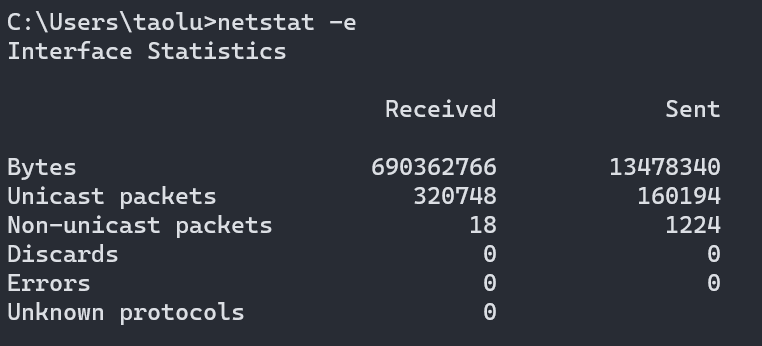

# auto-shutdown
此脚本适用于 Windows 操作系统在下载任务完成后自动关机

原理为通过 window 系统的命令 `netstat` 获取下载流量, \
通过计算得出下载速度, 并判断速度连续小于设定的值n次后 \
断言为下载任务已经完成, 此时执行关机命令 `shutdown` 关机 \

获取流量来源于命令输出的第一个数字, 如下图

#### 依赖
- [jre 8+](https://www.oracle.com/java/technologies/downloads/)
- [groovy 3.0+](https://groovy.apache.org/download.html)

#### 操作步骤
1. 执行下载任务, 确保下载速度大于阈值
2. 保存所有工作和文件, 为关机做好准备
3. 双击执行脚本

> 注意: 请确保启动该脚本前 所有需要保存的工作文件等都已保存, 对于脚本执行关机造成的损失概不负责

#### 配置说明
位于脚本中config属性, 可根据需求适当调整
- `lowTimesThreshold: 5`  断言次数: 5 =当下载速率连续低于指定值(lowMBps)5次时 执行关机
- `lowMBps          : 10` 速度阈值: 10=当下载速率低于10MBps时.记录次数加一
- `sleepIntervalSec : 3`  采样间隔: 3 =统计下载流量时间间隔为3秒
- `shutdownHolder   : 10` 关机延迟: 10=当执行关机时, 推迟10秒后关机

